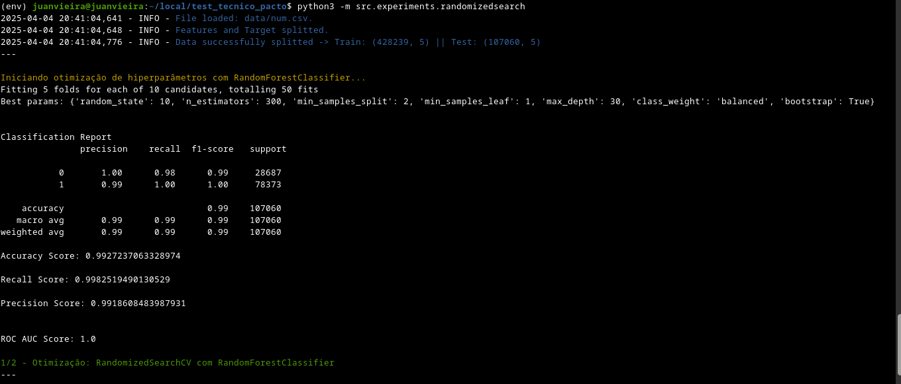
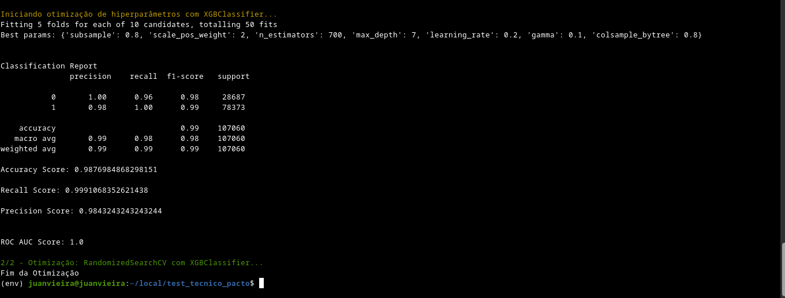

# Churn Prediction - Random Forest

Este modelo tem como objetivo prever a evasão de clientes (churn) utilizando algoritmos de aprendizado de máquina. O modelo principal implementado foi desenvolvido utilizando **RandomForestClassifier**, com foco em alta performance, interpretabilidade e robustez frente a desequilíbrios de classe.

---

## Dataset

- **Fonte**: Arquivo local `data/num.csv`
- **Tamanho**: 535.299 registros e 6 colunas (5 features + 1 target)
- **Target**: `churn` (binária: 0 = cliente retido, 1 = cliente perdido)

---

## Pré-processamento

- As variáveis preditoras (`X`) foram separadas do alvo (`y`)
- O conjunto de dados foi dividido em treino e teste com:
  - `test_size=0.2`
  - `stratify=y` para manter proporção de classes

---

## Modelo

Foi utilizado o algoritmo **Random Forest Classifier**, com foco em:
- Balanceamento de classes
- Profundidade controlada da árvore
- Redução de overfitting via `min_samples_leaf` e `min_samples_split`

### Hiperparâmetros utilizados:

```python
RandomForestClassifier(
    bootstrap=True,
    class_weight="balanced",
    max_depth=30,
    min_samples_leaf=2,
    min_samples_split=5,
    n_estimators=100,
    random_state=42
)
```

---

## Otimização de Hiperparâmetros

A seleção dos hiperparâmetros foi realizada em duas etapas complementares:

### 1. RandomizedSearchCV
Utilizado para realizar uma busca rápida e ampla em múltiplas combinações de parâmetros. Essa etapa ajuda a identificar regiões promissoras no espaço de busca sem gastar muitos recursos.

### 2. Bayesian Optimization (BayesSearchCV)
Após identificar os intervalos mais promissores, foi aplicada uma busca bayesiana mais aprofundada. Essa abordagem usa o histórico de avaliações para propor novos conjuntos de parâmetros com alta chance de melhorar a performance.

> Essa estratégia híbrida aproveita o melhor dos dois mundos: velocidade do Random Search e inteligência do Bayesian Optimization.

> Alguns exemplos na tela do terminal:




---

## Resultados

Após o treinamento, o modelo foi avaliado com as métricas abaixo:

### Classification Report

| Classe | Precision | Recall | F1-Score | Support |
|--------|-----------|--------|----------|---------|
| 0 (Retido) | 0.99 | 0.97 | 0.98 | 28.687 |
| 1 (Churn)  | 0.99 | 1.00 | 0.99 | 78.373 |
| **Accuracy** |     |      | **0.99** | 107.060 |

---

### Confusion Matrix

```
[[27959   728]
 [  329 78044]]
```

---

### Métricas Individuais

- **ROC AUC Score**: `0.9992`
- **Accuracy**: `0.9901`
- **Precision**: `0.9908`
- **Recall**: `0.9958`
- **F1-Score**: `0.9933`

> O modelo demonstrou alta capacidade de detectar churns com baixa taxa de falsos positivos.

---

## Salvamento do Modelo

O modelo treinado foi salvo em:

```bash
src/models/model.pkl
```

Pode ser carregado para previsões futuras com o `pickle`.

---

## Como Executar

Para treinar o modelo:

```bash
python3 -m src.steps.train
```

> Certifique-se de que o ambiente virtual está ativado e que todas as dependências estão instaladas.

## Observações Finais

- O modelo será integrado a API com FastAPI.
- Próximos passos: deploy em ambiente de produção com monitoramento.
